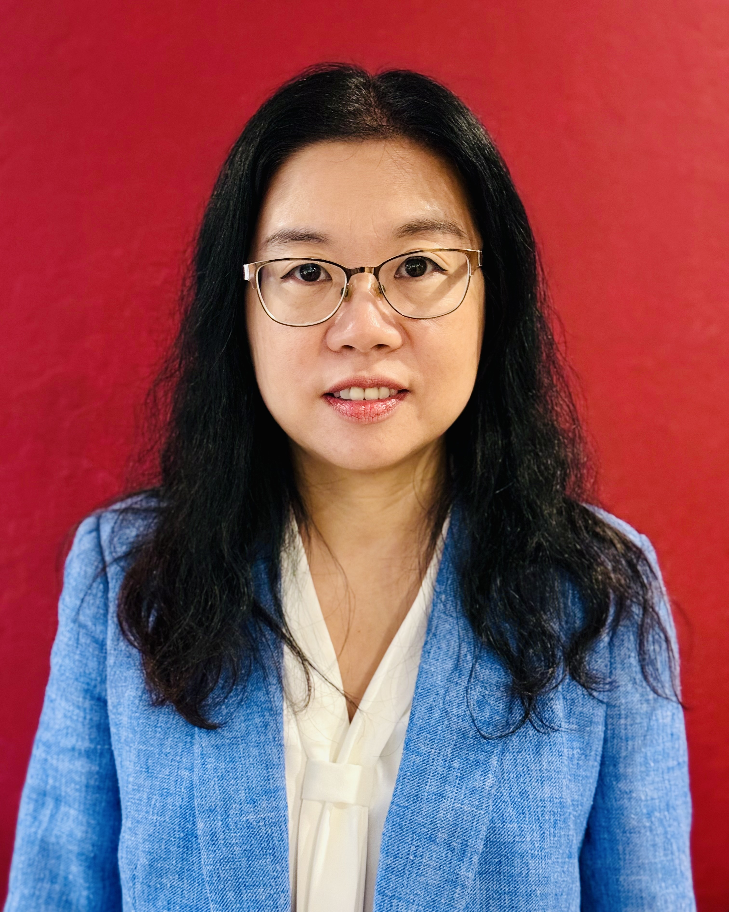
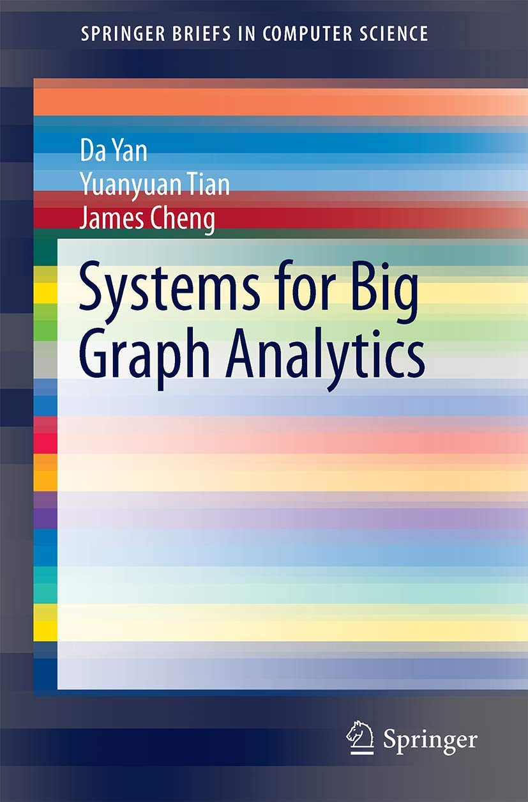
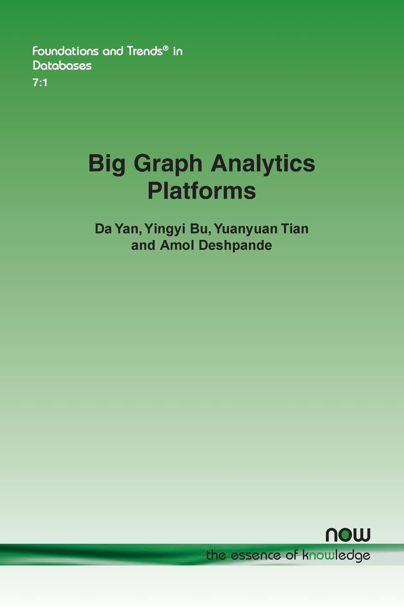

  
  

    <h1>Yuanyuan Tian (田媛媛)</h1>
    
Partner Scientist Manager & Graph Architect at Microsoft. 
    ACM Distinguished Member.

    
Previously Principal Research Staff Member at IBM Almaden Research Center. PhD and MS from University of Michigan, BS from Peking University.

    

      <a href="https://humming80.github.io/CV_Tian.pdf">CV</a> · 
      <a href="https://scholar.google.com/citations?user=_XE_jhQAAAAJ&hl=en">Google Scholar</a> · 
      [fullname without space]@microsoft[dot]com
    

  

## Current Research

Yuanyuan leads graph queries & analytics, query/workload optimization, and ML-for-Systems research in GSL. Her broader interests include Systems-for-ML, HTAP, big data, and cloud computing.

<h3>Graph Queries and Analytics</h3>

Yuanyuan has worked on graphs for most of her career — two books and 20+ papers. She is currently building scale-out graph query and analytics platforms, working with Azure data product teams and the Liquid team at LinkedIn. She founded and led <a href="https://www.ibm.com/support/producthub/icpdata/docs/content/SSQNUZ_latest/svc-db2w/db2w-graph-ovu.html">IBM Db2 Graph</a> and is an architect for <a href="https://learn.microsoft.com/en-us/fabric/graph/overview">Graph in Microsoft Fabric</a>. Her PhD thesis was on querying graph databases.

Selected Papers: Hardware Acceleration (DaMoN'26), Graph Databases Survey (SIGMOD Record'24, '22), Graph BI Benchmarking (DaMoN'23), Db2 Graph (SIGMOD'20, VLDB'19), Large-scale Graph Processing (ICDE'15, PVLDB'13), Graph Summarization (CIKM'14, ICDE'10, SIGMOD'08), Graph Matching (ICDE'08, Bioinformatics'07)

<h3>Workload Optimization</h3>

Yuanyuan and her team approach classical query optimization from a fresh angle — they advocate for Query Optimizer as a Service (QOaaS). The idea is to decouple the QO from the engine, enabling independent deployment, workload-level optimizations (index/view selection, ML-driven enhancements), shared development costs across engines, and multi-engine federation where sub-plans route to the best engine.

Selected Papers: Join Detection (EDBT'27), Industry Perspective for QO (SIGMOD Record'26), Bitmap Filter in SQL Server (CIDR'26), QOaaS (CIDR'25), Workload Forecasting (SIGMOD'24)

<h3>ML-for-Systems</h3>

Yuanyuan is co-leading the ML-for-Systems research in GSL. She and her team work with Azure data product teams on applying data-driven approaches to automate data services — spanning cloud infrastructure, query engines, and service layers.

Selected Papers: Autonomous Data Service Vision (SIGMOD'23), MLOS (VLDB'24), Semantic Equivalence Detection (SIGMOD'24)

## Past Research

<h3>SQL for Big Data</h3>

SQL-on-Hadoop, Hybrid Warehouses, and HTAP. Her SQL-on-Hadoop work tied to IBM Db2 Big SQL; the Wildfire HTAP system she co-developed became <a href="https://www.ibm.com/products/db2-event-store">IBM Db2 Event Store</a>.

Selected: HTAP for Big Data (VLDB'20, BigData'19, SIGMOD'19, EDBT'19, CIDR'17, SIGMOD'16 Demo), Hybrid Warehouses (TODS'16, EDBT'15), CoHadoop (PVLDB'11), Hadoop Joins (SIGMOD'10)

<h3>Systems for Machine Learning</h3>

Yuanyuan is the co-inventor and a lead developer of SystemML, now <a href="http://systemds.apache.org/">Apache SystemDS</a>. She also worked on integrating SQL and ML systems, and temporally-biased sampling for online model management.

Selected: Sampling for Online Model Management (Information Processing Letters'23, TODS'19, SIGMOD Record'19, EDBT'18), Integration of SQL and ML (EDBT'15), SystemML (SIGMOD'15, IEEE DE Bulletin'14, PVLDB'14, ICDE'12, ICDE'11)

## Books

Systems for Big Graph Analytics

D. Yan, Y. Tian, J. Cheng

SpringerBriefs in Computer Science, Springer, 2017

Big Graph Analytics Platforms

D. Yan, Y. Bu, Y. Tian, A. Deshpande

Foundations and Trends in Databases, Vol. 7: No. 1-2, pp 1-195, 2017

<a href="https://humming80.github.io/papers/Yan-Vol7-DBS-056.pdf">[PDF]</a>

## Selected Awards

<ul class="item-list">
<li>2023 DaMoN 2023 Best Short Paper Award, "Microarchitectural Analysis of Graph BI Queries on RDBMS"</li>
<li>2020 ACM Distinguished Member</li>
<li>2020 Outstanding Technical Achievement Award for contribution to IBM Db2 Event Store, IBM</li>
<li>2019 IBM A-Level Accomplishment for contribution to IBM Db2 Event Store, IBM Research</li>
<li>2019 Invention Achievement Award, IBM</li>
<li>2019 VLDB 2019 Distinguished Reviewer Award</li>
<li>2019 SIGMOD 2019 Research Highlight Award, "Online Model Management via Temporally Biased Sampling"</li>
<li>2019 Research Division Award for the work in declarative machine/deep learning, IBM</li>
<li>2019 Outstanding Technical Achievement Award for the work in large-scale graph analytics and infrastructure, IBM</li>
<li>2018 EDBT Best Paper Award, "Temporally-Biased Sampling for Online Model Management"</li>
<li>2018 IBM A-Level Accomplishment for the work in large scale graph analytics and infrastructure, IBM Research</li>
<li>2018 IBM A-Level Accomplishment for the work in declarative machine/deep learning (SystemML), IBM Research</li>
<li>2016 Outstanding Technical Achievement Award for the work in join algorithms for big data, IBM</li>
<li>2016 Eminence & Excellence Award, IBM Research</li>
<li>2015 IBM A-Level Accomplishment for the work in join algorithms for big data, IBM Research</li>
<li>2015 IBM A-Level Accomplishment for the contributions to the SystemML project, IBM Research</li>
<li>2013 High Value Patent Application Award, IBM Research</li>
<li>2012 Eminence & Excellence Award, IBM Research</li>
<li>2011 Eminence & Excellence Award, IBM Research</li>
<li>2008 Distinguished Achievement Award, University of Michigan</li>
<li>2007 2nd Place, CSE Honor Competition, University of Michigan</li>
<li>2007 Rackham Predoctoral Fellowship, University of Michigan</li>
<li>2003 Rackham Graduate Fellowship, University of Michigan</li>
</ul>

## Invited Talks

<ul class="item-list">
<li>2025 Towards Query Optimizer as a Service (QOaaS) in a Unified LakeHouse Ecosystem, South Bay System Meetup, November 2025.</li>
<li>2025 Building Autonomous Data Services on Azure (Keynote), AIDB@VLDB2025, September 2025.</li>
<li>2025 Towards Query Optimizer as a Service (QOaaS) in a Unified LakeHouse Ecosystem, University Of Massachusetts, April 2025.</li>
<li>2025 Towards Query Optimizer as a Service (QOaaS) in a Unified LakeHouse Ecosystem (Guest Lecture), Carnegie Mellon University, April 2025.</li>
<li>2025 Towards Autonomous Data Services on Azure (Guest Lecture), University of Michigan, April 2025.</li>
<li>2025 The World of Graph Databases from An Industry Perspective (Keynote), 1st Transforming Graph Data (TGD) Workshop, March 2025.</li>
<li>2025 Query Optimization in Practice: What Are the Realities and Trends?, Special EDBT/ICDT Joint Event on Theory & Practice of Query Processing, March 2025.</li>
<li>2024 Towards Autonomous Data Services on Azure, Learning Directed Operating System (LDOS) Symposium, November 2024.</li>
<li>2024 Graph Databases and AI, interview by Kyle Polich on <a href="https://dataskeptic.com/">Data Skeptic</a> Podcast, October 2024. <a href="https://dataskeptic.com/blog/episodes/2024/graph-databases-and-ai">Listen here</a>.</li>
<li>2024 Towards Autonomous Data Services on Azure, Microsoft Sponsor Talk, VLDB 2024, August 2024.</li>
<li>2023 The World of Graph Databases from An Industry Perspective, <a href="https://www.youtube.com/watch?v=AZuP_b95GPM">[Video]</a>, 16th LDBC TUC meeting, June 2023.</li>
<li>2022 Towards Autonomous Data Services on Azure: A GSL Journey, Sky Seminar, UC Berkeley, September 2022.</li>
<li>2022 Leading Women in Tech Q&A, Ontra, January 2022.</li>
<li>2020 Db2 Graph Query Drill Down, Db2 Technical Advisory Board Meeting, April 2020.</li>
<li>2017 Big Data Analytics: From SQL to Machine Learning and Graph Analysis (Keynote), <a href="https://www.slideshare.net/ytian1/big-data-analytics-from-sql-to-machine-learning-and-graph-analysis">[Slides]</a> <a href="https://www.youtube.com/watch?v=_2sjxj_CDSA&t=3240s">[Video]</a>, BigDas Workshop, SIGKDD 2017.</li>
<li>2017 Hybrid Transactional/Analytical Processing (Tutorial), <a href="https://www.youtube.com/watch?v=PG4acu9M65w">[Video]</a>, SIGMOD 2017.</li>
<li>2016 Big Graph Analytics Platforms (Tutorial), <a href="https://www.slideshare.net/ytian1/big-graph-analytics-systems-sigmod16-tutorial">[Slides]</a>, SIGMOD 2016.</li>
<li>2013 Giraph++: From "Think Like a Vertex" to "Think Like a Graph", Facebook, November 2013.</li>
<li>2013 Large Scale Topic-specific Influence Analysis on Microblogs, UC Santa Barbara, May 2013.</li>
<li>2013 Large Scale Topic-specific Influence Analysis on Microblogs, UC Santa Cruz, May 2013.</li>
<li>2012 SystemML: Large Scale Machine Learning on MapReduce, Peking University, August 2012.</li>
<li>2012 SystemML: Large Scale Machine Learning on MapReduce, IBM China Research Lab, August 2012.</li>
<li>2012 SystemML: Large Scale Machine Learning on MapReduce, University of Maryland, April 2012.</li>
</ul>

## Panels

<ul class="item-list">
<li>2025 Exciting Advances in Query Processing: Insights from Theory, Systems, and Industry, EDBT/ICDT 2025.</li>
<li>2025 The Future of Graph Transformations, 1st Transforming Graph Data (TGD) Workshop, March 2025.</li>
<li>2024 PhD Mentoring Panel (Moderator), VLDB 2024, August 2024.</li>
<li>2024 The Future of Graph Analytics, SIGMOD 2024, June 2024.</li>
<li>2024 AI for Systems, SIGMOD 2024, June 2024.</li>
<li>2023 FinBench Panel, 16th LDBC TUC meeting, June 2023.</li>
<li>2022 Women in DB: Discussion and Socialization, Organizer, CIDR 2022.</li>
<li>2021 Women in DB round table, VLDB 2021, August 2021.</li>
<li>2021 ICDE PhD Symposium Panel, ICDE 2021, April 2021.</li>
<li>2020 Round Table on Graph Databases, VLDB 2020.</li>
<li>2020 Deep Dive: In-Database Graph analytics with Db2, IBM DB2 Nebula Webinar Series, June 2020.</li>
<li>2020 "Women in DB: Experiences and Perspectives" event, Organizer, SIGMOD 2020.</li>
<li>2012 NSF Career Mentoring Panel, ICDE 2012. Her 2 cents on <a href="https://www.slideshare.net/ytian1/research-job-41535070">How to Be Competitive for Industrial Research Jobs</a>.</li>
</ul>

## Professional Service

**Editor**: SIGMOD PC Advisory Board Member · Associate Editor for VLDB 2025 · Associate Editor for SIGMOD 2024 · Associate Editor for Frontiers in Big Data (since 2021) · Associate Editor for VLDB Journal (2019–2025) · Associate Editor for PVLDB Vol. 11 (VLDB 2018) · Section Editor for Encyclopedia on Big Data Technologies.

**Chair**: SIGMOD 2027 PC Chair · VLDB 2025 DEI Chair · EDBT 2025 Industrial & Application Chair · SoCC 2023 PC Chair · VLDB 2023 Industry Chair · EDBT 2023 Demo Chair · CIDR 2023 Diversity & Inclusion Chair · CIDR 2022 Diversity & Inclusion Chair · VLDB 2021 Demo Chair · IEEE BigData 2019 Industry and Government Chair · VLDB 2019 Workshop Chair · ICDE 2017 Demo Chair · CIKM 2013 Poster Chair

**Workshop Chair**: 3rd Workshop on Large Scale Network Analysis (LSNA 2014) · 5th Workshop on Graph Data Management (GDM 2014) · 2nd LSNA (2013) · 4th GDM (2013) · 1st LSNA (2012)

**PC Member**: CIDR 2023 · SIGMOD 2023 Industry · SIGMOD 2022 Industry · CIDR 2022 · CIDR 2021 · VLDB 2020 Demo · SIGMOD 2020 · VLDB 2019 · SIGMOD 2018 · VLDB 2017 · VLDB 2016 Industrial · TKDE 2016 Poster · VLDB 2015 · ICDE 2014 · WISE 2013 · SIGMOD 2012 · GDM 2012 · VLDB 2011 Industrial · DBSocial 2011 · GDM 2011 · ICDE 2011 · GDM 2010 · VLDB 2009

**Reviewer for Journals**: VLDB Journal (2014, 2017) · TODS (2013, 2015) · Statistical Analysis and Data Mining (2009) · Information Systems (2010, 2011, 2013) · ACM TIST (2010) · Distributed and Parallel Databases (2012)

**Reviewer for Books**: Data Processing Techniques in The Era of Big Data

**Reviewer for Grants**: NSF Advisory Panel (2013, 2016) · Research Grants Council of Hong Kong (2010, 2011)

**Reviewer for Awards**: The NCWIT Award for Aspirations in Computing
